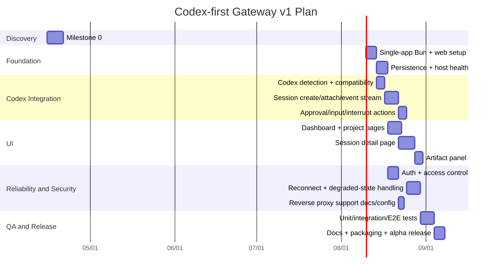

# Implementation Plan

## Goal

Turn the current product/design/architecture direction into a build-ready v1 plan for:

- a self-hosted gateway server
- a browser control plane
- a Codex-first backend integration
- a narrow adapter seam that keeps future Claude Code and OpenCode integrations cheap

This is the plan for a **real single-user open source v1**, not a throwaway prototype.

## Scope Assumptions

This plan assumes v1 includes:

- one self-hosted gateway server
- one browser UI
- installable PWA baseline
- Codex as the only deep backend integration
- local-only mode
- self-managed reverse-proxy/tunnel compatibility
- single-user auth
- project model plus session model
- dashboard, project, session, and settings flows
- artifact support for:
  - summary
  - changed-files list
  - test output
  - screenshots
  - recent log timeline

This plan explicitly excludes:

- managed relay service
- native iOS app
- multi-user collaboration
- team permissions / SSO
- generic remote shell
- deep browser-based file editing
- full backend parity with Claude Code and OpenCode

## Delivery Definition

### What counts as done for v1

A target user should be able to:

1. install the gateway on a home Mac
2. connect Codex
3. add one local repo as a project
4. leave that machine
5. open the web UI from another device
6. start or resume a session
7. inspect plan/checkpoints/artifacts
8. approve or steer the session remotely
9. survive a browser disconnect without losing the session view

If that loop is not reliable, v1 is not done.

## Recommended Technical Stack

This is the most pragmatic stack for the first build:

### Server

- TypeScript
- Bun
- Hono for HTTP API
- WebSocket support
- `bun:sqlite` for metadata
- filesystem-backed artifact storage
- Bun process / terminal primitives for Codex and shell sessions

### Web client

- React
- Vite + React Router
- TanStack Query
- xterm.js
- PWA support
- Tailwind optional, but keep UI system simple

### Shared

- shared TypeScript modules for:
  - API types
  - event payloads
  - core domain types

### Packaging

- local dev via `bun`
- desktop-host wrapper deferred unless needed
- Docker secondary, not primary onboarding

Reason:

- one runtime for gateway and tooling
- easiest path to one single-process app
- fastest path to shared types
- lowest friction for event-heavy gateway plus web UI

## Architecture Slice

The implementation should be split into five workstreams:

1. **Core gateway**
2. **Codex adapter**
3. **Persistence and artifact model**
4. **Browser UI**
5. **Auth, host health, and reliability**

## Pages

### 1. Login

Purpose:

- single-user auth for local and remote browser access

Core UI:

- login form
- password input
- session expired state
- invalid credentials state

Notes:

- keep this simple in v1
- no identity platform work
- successful login continues via cookie-backed browser session

### 2. Dashboard

Purpose:

- answer "what needs me right now?"

Core UI:

- Needs Attention
- Running Sessions
- Recently Finished
- Projects list

Required states:

- host healthy
- host degraded
- no projects
- no active sessions
- pending approvals

### 3. Project List / Project Create

Purpose:

- allow selecting and adding repos with as little ceremony as possible

Core UI:

- project cards/list
- add project action
- repo path input or picker
- backend selection, default Codex

Required states:

- no projects
- invalid repo path
- Codex unavailable
- duplicate project

### 4. Project Detail

Purpose:

- durable home for one repo

Core UI:

- Sessions tab
- Queue/Drafts placeholder
- Branches/Worktrees summary
- Project settings

Required states:

- empty sessions list
- sessions loading
- project degraded because host/backend unhealthy

### 5. New Session Flow

Purpose:

- start useful work fast

Core UI:

- goal/prompt input
- optional session title
- backend shown as Codex
- start action

Required states:

- input empty
- backend unavailable
- create-session failure

### 6. Session Detail

Purpose:

- this is the most important page in v1

Core UI:

- latest summary
- timeline/checkpoints
- pending approval/question block
- action bar:
  - approve
  - reject
  - send steer
  - interrupt/stop
- artifact panel:
  - test output
  - screenshots
  - changed-files list

Required states:

- live attached
- reconnecting
- degraded
- completed
- failed
- artifact partially unavailable

### 7. Host / Access Settings

Purpose:

- make host health and security visible

Core UI:

- Codex detection and version
- host status
- repo allowlist visibility
- access mode:
  - local-only
  - self-managed remote

Required states:

- Codex not detected
- Codex incompatible
- host unhealthy

## UX Requirements

### Primary UX principle

The product should optimize for:

- quick remote understanding
- low-friction approval
- safe interruption

Not for:

- deep code browsing
- terminal replacement
- IDE replacement

### Mobile UX jobs

The phone should be optimized for:

- checking current status
- approving the next step
- answering one clarification question
- stopping or interrupting a bad session
- reviewing the latest artifact summary

### UX anti-goals

- no giant log wall as the default session page
- no file tree as the primary entry point
- no project administration friction before first value

## API Surface

### Auth

| Method | Path | Purpose |
|---|---|---|
| `POST` | `/api/auth/login` | create browser auth session |
| `POST` | `/api/auth/logout` | end browser auth session |
| `GET` | `/api/auth/me` | current auth/session info |

### Host / backend

| Method | Path | Purpose |
|---|---|---|
| `GET` | `/api/host/status` | host health, storage health, adapter health |
| `GET` | `/api/backends` | list supported backends and Codex status |

### Projects

| Method | Path | Purpose |
|---|---|---|
| `GET` | `/api/projects` | list projects |
| `POST` | `/api/projects` | create project |
| `GET` | `/api/projects/:projectId` | project detail |
| `PATCH` | `/api/projects/:projectId` | update settings |

### Sessions

| Method | Path | Purpose |
|---|---|---|
| `GET` | `/api/projects/:projectId/sessions` | list project sessions |
| `POST` | `/api/projects/:projectId/sessions` | create new session |
| `GET` | `/api/sessions/:sessionId` | session detail |
| `POST` | `/api/sessions/:sessionId/input` | send steer / follow-up |
| `POST` | `/api/sessions/:sessionId/approve` | respond to pending gate |
| `POST` | `/api/sessions/:sessionId/interrupt` | interrupt or stop |

### Artifacts

| Method | Path | Purpose |
|---|---|---|
| `GET` | `/api/sessions/:sessionId/artifacts` | list artifacts for session |
| `GET` | `/api/artifacts/:artifactId` | fetch one artifact |

### Streaming

| Method | Path | Purpose |
|---|---|---|
| `WS` | `/ws` | live dashboard/project/session updates |

## Domain Objects

### Project

- id
- name
- repo_path
- host_id
- default_backend
- created_at
- updated_at

### SessionRef

- id
- project_id
- backend
- backend_session_id
- title
- last_summary
- needs_attention
- attention_reason
- degraded
- created_at
- updated_at

### ArtifactRef

- id
- session_id
- type
- title
- storage_key
- metadata
- created_at

### Event

- id
- session_id
- type
- payload
- ts

## Work Breakdown Structure

## Epic 1: Repository and app foundation

Tasks:

1. create single-app repository layout
2. add Bun + Hono server entry
3. add Vite web app entry
4. add shared type modules
5. add lint, typecheck, test scaffolding
6. add local env boot docs

Deliverable:

- runnable local full-stack Bun workspace

### Estimate

- **PD:** 3-5
- **Code:** 800-1,500 LOC

## Epic 2: Core gateway and persistence

Tasks:

1. `bun:sqlite` schema for projects, sessions, events, artifacts, auth sessions
2. filesystem artifact storage layout
3. repository layer
4. host health service
5. basic HTTP API server

Deliverable:

- gateway process with persistence and health endpoints

### Estimate

- **PD:** 5-7
- **Code:** 1,200-2,000 LOC

## Epic 3: Codex adapter

Tasks:

1. Codex detection
2. Codex version compatibility check
3. process launch/supervision on Bun
4. create-session integration
5. attach/resume integration
6. event ingestion
7. approval / input / interrupt actions
8. adapter-to-gateway translation layer

Deliverable:

- first working Codex integration

### Estimate

- **PD:** 8-12
- **Code:** 1,800-3,000 LOC

## Epic 4: Session persistence and rehydration

Tasks:

1. event persistence
2. session summary derivation
3. degraded-state model
4. gateway restart recovery
5. browser reconnect semantics

Deliverable:

- reliable session detail page after disconnect/reload/restart

### Estimate

- **PD:** 5-8
- **Code:** 1,000-1,800 LOC

## Epic 5: Auth and access control

Tasks:

1. single-user login flow
2. session cookie/auth token model
3. auth middleware
4. project repo allowlist
5. reverse-proxy-safe config support

Deliverable:

- browser access control good enough for self-hosted v1

### Estimate

- **PD:** 4-6
- **Code:** 800-1,400 LOC

## Epic 6: Dashboard and project UI

Tasks:

1. dashboard page
2. projects list/create page
3. project detail page
4. host/settings page
5. empty/error/degraded states

Deliverable:

- navigable browser shell

### Estimate

- **PD:** 6-9
- **Code:** 1,500-2,500 LOC

## Epic 7: Session detail UI

Tasks:

1. live timeline view
2. latest summary block
3. approval/question action bar
4. steer / interrupt controls
5. artifact panel
6. mobile viewport behavior
7. embedded terminal drawer shell

Deliverable:

- usable remote session page

### Estimate

- **PD:** 7-10
- **Code:** 1,800-3,000 LOC

## Epic 8: Artifact support

Tasks:

1. summary storage
2. log timeline storage
3. changed-files list support
4. test output support
5. screenshot support
6. artifact fetch endpoints

Deliverable:

- artifacts visible and inspectable remotely

### Estimate

- **PD:** 4-6
- **Code:** 800-1,500 LOC

## Epic 9: Reliability hardening

Tasks:

1. host sleep/wake handling
2. backend unavailable handling
3. incompatible Codex handling
4. stale action conflicts
5. Bun runtime compatibility checks
6. reconnect + degraded-state UX polish

Deliverable:

- product no longer lies when the backend or connection breaks

### Estimate

- **PD:** 5-8
- **Code:** 1,000-1,800 LOC

## Epic 10: Testing, docs, packaging

Tasks:

1. unit tests
2. integration tests
3. first E2E flow
4. install docs
5. reverse proxy docs
6. release and packaging setup

Deliverable:

- releasable OSS alpha

### Estimate

- **PD:** 6-10
- **Code:** 1,500-2,500 LOC

## Total Effort Estimate

### Scenario A: throwaway proof of concept

- **Scope:** one host, one repo, one session, almost no hardening
- **PD:** 12-18
- **Code:** 3,000-5,000 LOC
- **Result:** enough to prove the loop, not enough to trust

### Scenario B: usable personal alpha

- **Scope:** real Codex loop, browser reconnect, auth, basic artifacts, basic hardening
- **PD:** 25-35
- **Code:** 6,500-10,000 LOC
- **Result:** something you could personally use and dogfood hard

### Scenario C: solid open source v1

- **Scope:** all epics above at a respectable quality bar
- **PD:** 49-71
- **Code:** 12,200-21,000 LOC
- **Result:** credible public OSS release

## Recommended Planning Number

Use this as the main planning assumption:

- **Target:** usable personal alpha moving toward public OSS release
- **Estimate:** **32-42 PD** for a strong first release candidate
- **Likely code size:** **8k-12k LOC app code**, plus **2k-4k LOC tests/docs/scripts**

This is the realistic middle.

Not tiny. Not insane.

## AI-assisted Compression Estimate

If built by one strong engineer using Codex heavily:

- **Human-equivalent PD:** 32-42
- **Likely calendar time:** 3-6 focused weeks

If built without strong agent assistance:

- **Human-equivalent PD:** still 32-42
- **Likely calendar time:** 6-10 weeks for one engineer

## Milestones

### Milestone 0: technical spike

Outcome:

- confirm Codex create/attach/event loop
- confirm what artifacts can be extracted cheaply
- confirm Bun process + terminal behavior is good enough for v1

Deliverables:

- tiny Bun server script
- raw event logging
- terminal spike notes
- notes on Codex integration gaps and Bun runtime gaps

Estimate:

- **PD:** 4-6

### Milestone 1: gateway backbone

Outcome:

- server, persistence, health, projects API

Deliverables:

- single-process Bun app skeleton
- DB schema
- host status
- project CRUD

Estimate:

- **PD:** 6-8

### Milestone 2: Codex session loop

Outcome:

- create session
- attach session
- stream events

Deliverables:

- first working Codex adapter
- session APIs
- live event pipe

Estimate:

- **PD:** 8-10

### Milestone 3: browser control plane

Outcome:

- dashboard
- project page
- session page
- approval and steer actions

Deliverables:

- usable browser UI for the core loop

Estimate:

- **PD:** 8-10

### Milestone 4: hardening

Outcome:

- auth
- reconnect
- degraded states
- compatibility checks

Deliverables:

- trustworthy alpha

Estimate:

- **PD:** 6-8

### Milestone 5: release prep

Outcome:

- tests
- docs
- package/release scripts

Deliverables:

- OSS alpha release candidate

Estimate:

- **PD:** 5-7

## Gantt Chart

## Critical Path

The true critical path is:

1. Codex spike
2. persistence backbone
3. Codex adapter
4. session detail page
5. reconnect/degraded handling
6. tests + release prep

If any of these slip badly, the product stays demo-only.

## Staffing Model

### One strong full-stack engineer

Best for:

- product coherence
- fast iteration
- lower coordination cost

Expected:

- 32-42 PD for a serious alpha/release candidate

### Two-person split

Good split:

- Engineer A: gateway + Codex adapter + persistence
- Engineer B: web UI + auth + UX states

Expected:

- 20-28 working days elapsed
- but higher coordination cost and more integration risk

### Recommended

If this is still pre-build and product discovery is hot:

- one strong builder first
- maybe add second engineer only after Milestone 2 is working

## Risks

### Risk 1: Codex integration semantics drift

Impact:

- medium to high

Mitigation:

- explicit version checks
- compatibility matrix
- adapter seam kept narrow

### Risk 2: reconnect and degraded-state complexity is larger than expected

Impact:

- high

Mitigation:

- build this early
- do not leave it to polish week

### Risk 3: security and reverse-proxy setup are too weak for real remote use

Impact:

- high

Mitigation:

- local-only safe default
- auth required in all modes
- documented trust boundary

### Risk 4: browser UX is not good enough on phones

Impact:

- medium

Mitigation:

- optimize for approve/steer/check, not editing
- mobile viewport testing early

### Risk 5: Bun runtime edge cases force awkward workarounds

Impact:

- medium to high

Mitigation:

- spike PTY/process behavior in Milestone 0
- isolate runtime-sensitive interfaces early
- avoid Node-native dependencies by default

## Exit Criteria Per Milestone

### M0 exit

- can start Codex-backed session from code
- can read useful event stream
- can prove Bun process and terminal primitives are viable for the gateway loop

### M1 exit

- can persist projects and session refs
- host health API works

### M2 exit

- can create and resume Codex sessions through gateway

### M3 exit

- browser can start session, inspect progress, approve next step

### M4 exit

- reconnect and degraded states behave honestly
- auth and reverse-proxy-safe config are in place

### M5 exit

- install docs work
- first alpha release can be published

## Recommended Next Step

Start with **Milestone 0 + Milestone 1 planning tickets**, not the whole board.

The first week should answer:

- what the Codex seam actually looks like
- what event and artifact model survives real usage
- what abstractions are fake and can be cut

That will save weeks later.
